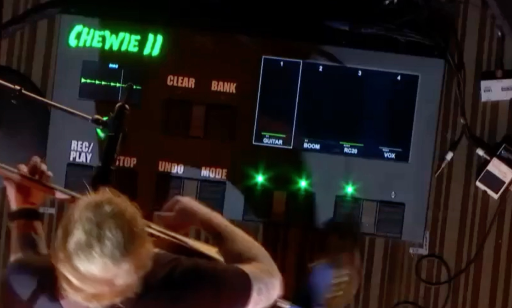
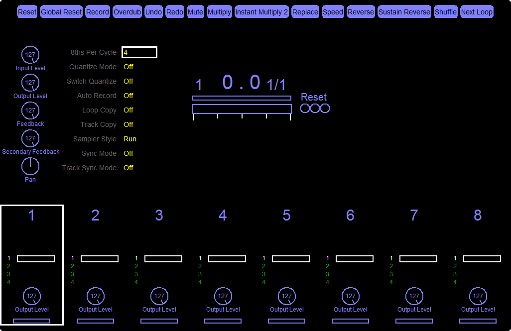
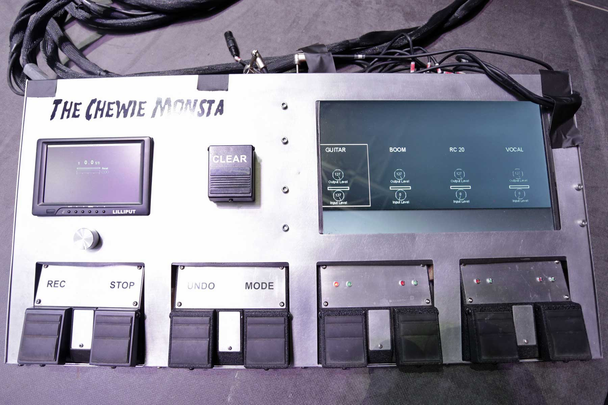

# The master plan

I would like to create a loop pedal that looks similar to the Chewie Monsta 2.

This is going to be a software and a hardware project, as after some research I am led to believe that there is no off the shelf solution that can replicate the software of the Chewie 2.

**Features I'd like to have**
- Two external "presenter" views
    - Loop waveform display. Output of the currently selected loop track (the small screen on the chewie monsta)
    - Track selection + output (the large screen on the chewie monsta)
- 4 Tracks
- Each track can be overdubbed + undone
- MIDI Controllable - I have a teensy and a bunch of foot pedals.
- JS Scripting for behaviour? [Info](https://forum.juce.com/t/javascriptengine-how-to-add-methods-to-a-dynamicobject/11798)

I don't really know a lot about how best to structure an audio application such as this project. Here are a few things that I thought of trying out based on my reading of the [JUCE API documentation](https://www.juce.com/doc/classes).

## Things I've tried

### Max

I started out with playing around with Max, and managed to get a single track looping, overdubbing, along with a waveform display in an OpenGL window! One thing that I was unable to figure out was how I could non-destructvely add layers onto each track. This is required to implement the undo feature. 

This issue, plus the mess that my patches were led me to looking into other possible methods.

### JUCE

JUCE is a C++ framework for creating realtime audio apps. It is awesome.

I've started playing around with this and so far it's lookin promising.

---

## Inspiration

### The Chewie Monsta 2

The Chewie Monsta 2 is Ed Sheerans' current Loop Pedal. The second interation has a few differences from the 1st, as far as I can tell. The main one is that I believe that it isn't based off of [Mobius](http://www.circularlabs.com/). Although Mobius is fricking awesome, it doesn't provide the Loop Waveform display that is visible on the Chewie Monsta 2's foot controller.

https://www.youtube.com/watch?v=HIKj1qiV_P4

https://youtu.be/ocPa8w0UHks?t=25

#### Control Breakdown*

I watched a load of videos, researched all I could on the internet [Sonit Pedals](http://www.sonnit.co.uk/index.html) & this [instructable](http://www.instructables.com/id/DIY-Chewie-Monsta-Ed-Sheeran-Loop-Pedal/) by the same person were gold to help figure out how it all works.

Here's what I think it is:

Pedal | Control Mode | Action
--- | --- | ---
Clear | Rec | Clears the current track
| - | Play | Clears everything
Bank | Rec | ?
| - | Play | ?
Rec/Play | Rec | Record -> Overdub -> Play onto the seleted track. If this records into the first track then this will become the lead loop and set the duration for the other tracks. 
| - | Play | Unmute all tracks. If all tracks are muted, then it will set the position to 0 and play.
Stop | Rec | Mute the current track
| - | Play | Mute all tracks
Undo | Rec | Undo the last recorded layer
| - | Play | Nothing?
Mode | Rec | Switch to Play mode & change any tracks that are in Overdub or Recording to Play.
| - | Play | Switch to record mode.
Track X | Rec | Select track X & Record/Overdub. If the track is in Record/Overdub it will switch to Play.
| - | Play | Play and Mute track X

The Sonit pedal achieved this functionality via Mobius' scripts. Really awesome way of doing it - and adding scripting into Looper is something that I'm now interested in. However, I will think about that later...

Other input | Description
--- | ---
Knob | This is the knob underneath the liliput in v1. This also made it to v2, and my best guess right now it this changes the volume? Input/Ouput I'm not sure.

#### Parts breakdown

These are my best guesses and in no way represents what was actually used. These assumptions are guided by what you can see was used on the Chewie Monsta v1:

Part | Amount | Description
--- | --- | ---
Pedals | x10 | These look like 5 gutted Boss RC-30 units. At $300 US each, this is $$$$!
Knob | x1 | This is the knob underneath the liliput in v1. This also made it to v2, and my best guess right now it this changes the volume? Input/Ouput I'm not sure.
Smaller display | x1 | 7" (?) Lilliput that shows the loop status
Larger display | x1 | 15" Display (?)
LEDs | x6 | These are multicoloured LEDs that change between red/green depending on the mode of the pedal.
Circular LED Indicator | x1 | This is the circle indicator underneath the smaller display. It looks like this could be achieved with something like a [NeoPixel LED Ring](https://www.adafruit.com/product/1463) and a difuser of sorts. There also is a knob in the middle of it
Knob + PetentoMeter | x1 | Not sure on the function of this, but it's there!
Teensy/Arduino | x1 | I assume that a chip was used to connect everything together and send MIDI events to the connected laptop that the custom software / VST can decode.

### Mobius

[Mobius](http://www.circularlabs.com/) is probably the best multipurpose looping software! It's got so many options that you can tweak, as well as a whole scripting side of it!

Mobius is used on the original version of the Chewie Monsta pedal:

There is a person on the Mobius forums who created their own version. They even wrote an [instructable](http://www.instructables.com/id/DIY-Chewie-Monsta-Ed-Sheeran-Loop-Pedal/) so you can make your own! If you want to buy a pre-made one they're selling them now at [Sonit Pedals](http://www.sonnit.co.uk/index.html).

That instructable and [this thread on the forums](http://www.circularlabs.com/forums/showthread.php?t=1338) were a massive inspiration and help in figuring out how it works, so if there is any chance you come across this, thankyou!